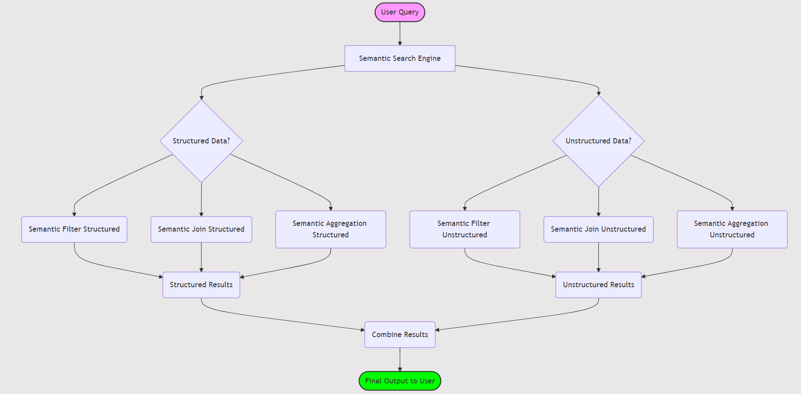

# Semantic Search Over Structured Unstructured Data
TAG: Semantic Search Over Structured &amp; Unstructured Data


## Introduction

Full Article : [https://medium.com/@learn-simplified/lets-build-a-real-estate-advisory-company-using-ai-agents-59d6e2bac78a

Hands on with Declarative prog model & optimized query engine for serving powerful reasoning-based query pipelines over structured and unstructured data


## What's This Project About

This article breaks down the technical concepts of the research paper, "TAG: Semantic Search Over Structured & Unstructured Data", into simple language, making it accessible and exciting for readers unfamiliar with complex computer science.
The paper presents an innovative search system, TAG, that uses AI to enhance semantic searches over various types of data. TAG's primary goal is to help users navigate massive datasets, whether they're structured (like databases) or unstructured (like articles or reports), by introducing AI-driven tools that can understand the meaning behind the data.

## Why Work on It?

Understanding how TAG works can give you insight into the future of data search. As businesses, researchers, and individuals handle more information than ever before, they face a significant challenge in making sense of it all. TAG solves this by leveraging AI for smarter searches that go beyond keywords and into the meaning of the content itself. 
Whether you're involved in data science, research, or just want to know how future technology will improve information processing, this article explains why TAG is important and how it can impact a wide range of fields.

## Architecture



# Tutorial: Semantic Search Over Structured &amp; Unstructured Data

## Prerequisites
- Python installed on your system.
- A basic understanding of virtual environments and command-line tools.

## Steps

1. **Virtual Environment Setup:**
   - Create a dedicated virtual environment for our project:
   
     ```bash
     python -m venv Semantic_Search_Over_Structured_Unstructured_Data
     ```
   - Activate the environment:
   
     - Windows:
       ```bash
       Semantic_Search_Over_Structured_Unstructured_Data\Scripts\activate
       ```
     - Unix/macOS:
       ```bash
       source Semantic_Search_Over_Structured_Unstructured_Data/bin/activate
       ```
   
# Installation and Setup Guide

**Install Project Dependencies:**

Follow these steps to set up and run the 'Real Estate Advisory Company Using AI Agents' project:

1. Navigate to your project directory:
   ```
   cd path/to/your/project
   ```
   This ensures you're in the correct location for the subsequent steps.

2. Install the required dependencies:
   ```
   pip install -r requirements.txt
   ```
   This command installs all the necessary Python packages listed in the requirements.txt file.


## Run - Semantic Search Over Structured &amp; Unstructured Data

   ```bash 
      # Run Semantic Search Over Structured &amp; Unstructured Data
      python main.py
      
   ```


